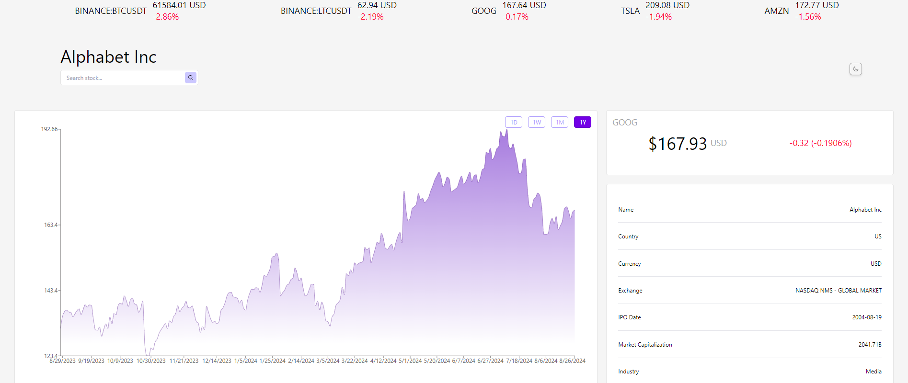
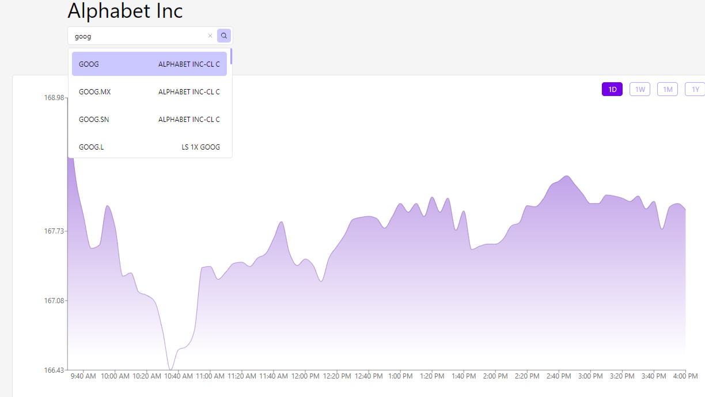
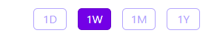
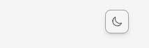
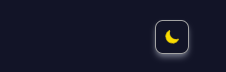
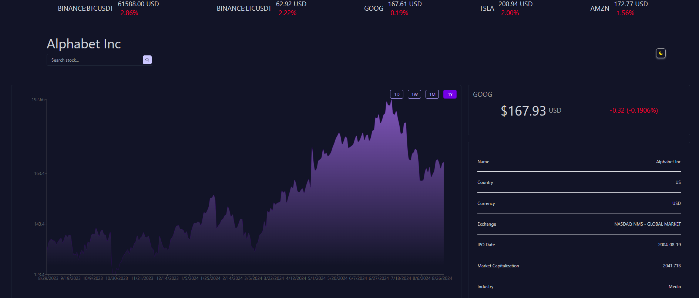

# Stock Dashboard

## Overview

This React app is designed to provide users with latest stock and cryptocurrency data upon query, visualized in an interactive dashboard. It connects to a REST API (Finnhub) to fetch financial data, and establishes a WebSocket connection for live updates. This is a responsive, dynamic website that features intuitive and interactive UI components.

## Features

### Search Bar

Allows users to search for stock symbols. The organization name will appear on top of the searchbar upon selection; the charting area (with a filter of 1 Week if not formerly specified) and overview card will be updated simultaneously and correspondently. 

### Time-Range Selector

Enables users to customize the time range of historial data aggregated and displayed.

### Charting

Displayes the selected stock's prices over time using a linear gradient graph from the Recharts library.

### Overview Card

Provides the selected stock's previous closing price and the percentage change of the current price from it, and additionally some essential company details.

### Live Price Updates

Features a top banner displaying live prices of selected cryptocurrencies and stocks, updated in real-time through a WebSocket connection to the Finnhub API.

### Dark Mode Toggler

The webpage is under light mode by default, users can switch to dark mode through the moon icon.

The resulting webpage style is demonstrated as follows:

## Technologies Used

React.js for a component-based design\
Javascript's WebSocket API\
The charting library Recharts\
Tailwind CSS for component styling and layout flexibility

